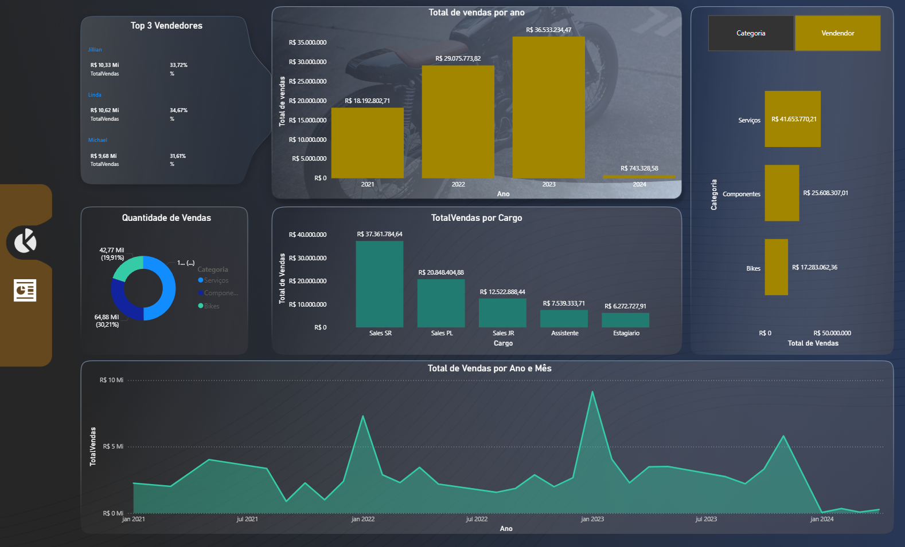
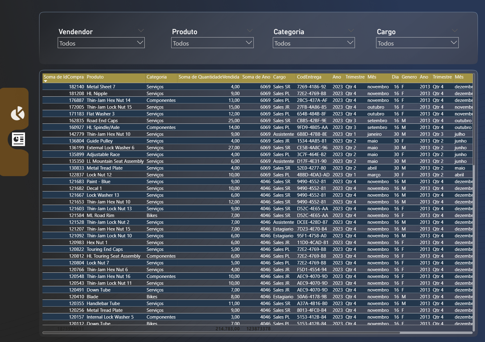

# 🚴 Bike Sales Dashboard - Power BI

Projeto desenvolvido em Power BI com foco em análise de vendas, faturamento e indicadores comerciais de uma loja de bicicletas.

---

# 📌 Objetivo

O objetivo deste dashboard é transformar dados comerciais em informações estratégicas para apoio à tomada de decisão, permitindo acompanhar KPIs de vendas, performance comercial e comportamento operacional.

---

# 🛠️ Tecnologias Utilizadas

- Power BI
- Power Query
- DAX
- SQL
- Excel

---

# 📊 Principais Análises

- Faturamento total
- Evolução de vendas
- Produtos mais vendidos
- Performance comercial
- Indicadores estratégicos
- Visualização de KPIs

---

# 🖼️ Dashboard

## Visão Geral

---

## Análise de Vendas

---

# 📚 Aprendizados

Durante o desenvolvimento deste projeto, foram aplicados conceitos de:

- Modelagem de dados
- Criação de KPIs
- Tratamento de dados
- DAX
- Storytelling com dados
- Visualização analítica

---

# 🚀 Sobre o Projeto

Este projeto foi desenvolvido com foco em prática de análise de dados e construção de dashboards interativos, aplicando conceitos de Business Intelligence para transformar dados em informações estratégicas.
